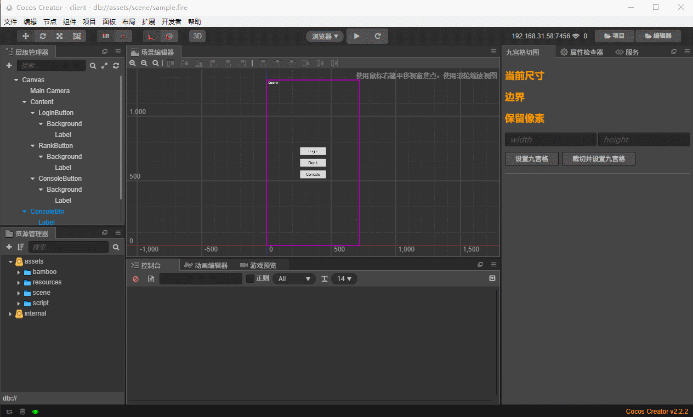

# CocosCreator 九宫格插件
这是个简陋的九宫格切图工具，可以自动设置图片的九宫格边界，并裁切多余的像素。

## 安装
+ 前往[Cocos扩展商店](https://store.cocos.com/#/resources/detail/2387)下载
+ 将本插件放在 ~/.CocosCreator/packages (Windows用户为 C:\Users\${你的用户名}\.CocosCreator\packages)
+ 或者放入到 ${你的项目路径}/packages
+ 如果直接clone本仓库，需要先运行npm install jimp手动安装jimp库

## 使用
+ 打开插件界面:菜单 扩展》九宫格切片工具
+ 在资源面板选中图片
+ 点击设置九宫格，或者裁切

## TIPS
+ 只能裁一些简单干净的UI，无法处理渐变的底板
+ 目前版本不稳定，裁图前请做好备份或者版本管理

## TODO
+ 批量裁切